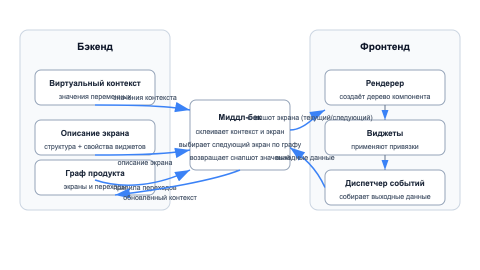
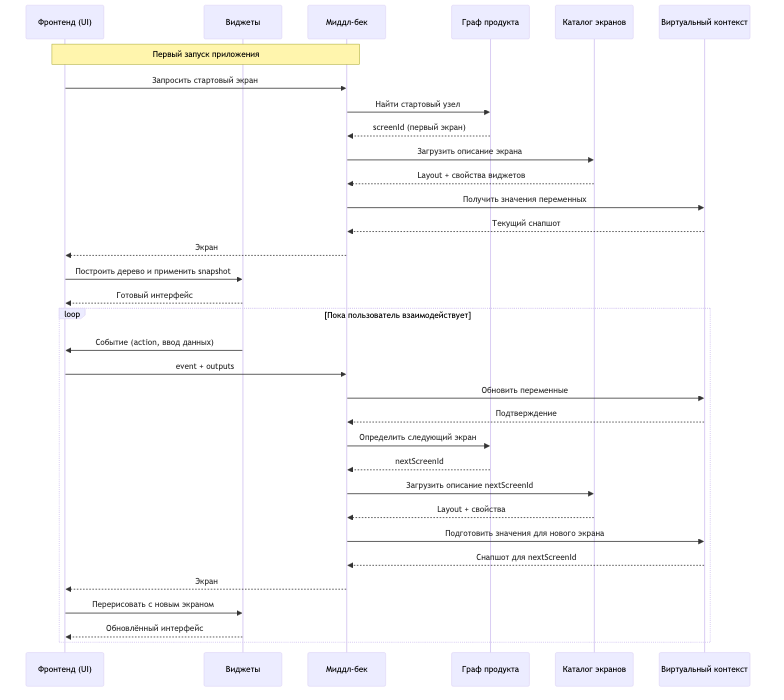
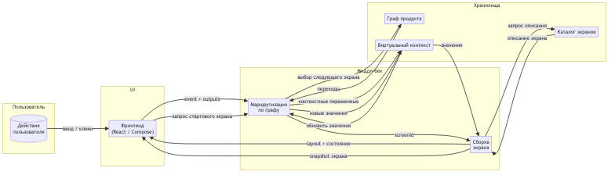
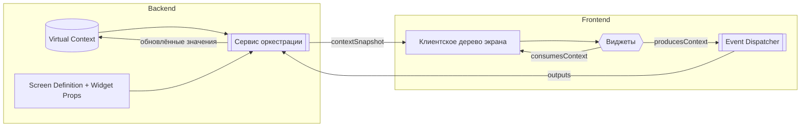

# BDUI Admin Panel - Business-Driven User Interface Platform

> Комплексная low-code платформа для создания продуктов с drag-and-drop интерфейсом, real-time превью и seamless data binding через систему виртуального контекста.

[](https://react.dev/)
[](https://vitejs.dev/)
[]()

## 📑 Содержание

- [Основные возможности](#-основные-возможности)
- [Архитектура](#️-архитектура)
- [Быстрый старт](#-быстрый-старт)
- [Структура проекта](#-структура-проекта)
- [Система аналитики](#-система-аналитики)
- [Демо-сценарии](#-демо-сценарии)
- [Design Tokens](#-design-tokens--кросс-платформенный-стилинг)
- [API и контракты](#-api-и-контракты)
- [Тестирование](#-тестирование)
- [Deployment](#-deployment)
- [Рабочие процессы](#-рабочие-процессы)

## 🚀 Основные возможности

### Конструктор продуктов
- **Product List Dashboard**: управление продуктами с grid/table view, поиском, фильтрацией и CRUD операциями
- **Product Overview**: редактирование метаданных, визуализация графа экранов, глобальные настройки
- **Screen Flow Editor**: визуальный редактор графа переходов на React Flow с custom узлами (screens, actions, conditions)
- **UI Builder**: drag-and-drop компонентов с real-time превью, панель свойств, data binding к виртуальному контексту
- **Sandbox**: интерактивная среда для тестирования графов продуктов с навигацией, контекстными патчами и историей

### Система аналитики 📊
- **Event Tracking**: автоматический сбор событий (SCREEN_VIEW, UI_CLICK, INTERACTION_TIME, SESSION_START)
- **Analytics Dashboard**: визуализация метрик с Recharts (timeline, screen stats, click stats, сводные карточки)
- **Persistence**: хранение событий в localStorage с TTL (6 часов)
- **Session Management**: автоматическое управление сеансами с таймерами экранов
- **Integration**: встроенная интеграция в SandboxPage, ApiSandboxRunner, SandboxScreenRenderer

### Virtual Context System
- **Централизованное состояние**: хранение переменных из пользовательских вводов, API-вызовов и действий
- **Data Binding**: двусторонняя привязка данных между компонентами и переменными
- **Type Inference**: автоматический вывод типов (string, number, boolean, array, object) с защитой от "понижения"
- **Context Patching**: применение изменений с побочными эффектами (форматирование, fallback-значения)
- **Dependency Tracking**: граф зависимостей между переменными для валидации

### Библиотека компонентов
- **Widgets**: button, text, input, image, container, row, column, list, section
- **Widget Presets**: готовые стилевые пресеты для кнопок, полей, списков с поддержкой вариантов (primary/secondary) и размеров
- **Screen Renderer**: поддержка legacy формата `components` и нового `sections` с вложенными children

### Декларативная архитектура (2025) 🆕
- **Events in Edges**: события описаны в рёбрах через поля `event` и `keepInputs` — никакого хардкода в сервере
- **Action Nodes**: бизнес-логика вынесена в JSON через `data.actionType` и `data.config` (например, `modify-cart-item`)
- **Universal Server**: сервер читает конфигурацию и интерпретирует — не зависит от конкретных пресетов
- **Zero Hardcode**: добавление нового события не требует изменений в коде, только в JSON
- **См. документацию**: [Декларативный рефакторинг](./docs/declarative-refactoring.md) — подробный отчёт о миграции логики в JSON

## 🏗️ Архитектура

### Диаграмма взаимодействия компонентов

<p align="center">
	
</p>

### Последовательность оркестрации экрана

<p align="center">
	
</p>

### Потоки данных платформы

<p align="center">
	
</p>

### Архитектура потока данных



**Ключевые принципы:**
- Middleware объединяет описание экрана (`screenDef`) и актуальные значения из виртуального контекста (`ctx`)
- Рендерер подставляет snapshot в каждый виджет с флагом `consumesContext`
- Виджеты с `producesContext` отправляют изменения через Event Dispatcher
- Middleware обновляет контекст, выбирает следующий узел графа и возвращает консистентный snapshot

### Структура компонентов

```
src/
├── context/
│   └── VirtualContext.jsx           # Глобальное состояние (редьюсер, actions, зависимости)
├── services/
│   └── analytics/                   # Система аналитики
│       ├── analyticsStore.js        # Хранилище событий с localStorage
│       ├── AnalyticsProvider.jsx    # React provider
│       ├── useAnalytics.js          # Хуки для трекинга
│       └── analyticsSelectors.js    # Агрегация данных для dashboard
├── components/
│   └── Layout/                      # Layout компоненты (Header, Sidebar)
├── pages/
│   ├── ProductList/                 # Dashboard с grid/table продуктов
│   ├── ProductOverview/             # Метаданные и граф экранов
│   ├── ScreenEditor/                # Flow editor на React Flow
│   ├── ScreenBuilder/               # UI builder с drag-and-drop
│   ├── Sandbox/                     # Интерактивная среда тестирования
│   │   ├── SandboxPage.jsx          # Основной UI песочницы
│   │   ├── ApiSandboxRunner.jsx     # API-режим с fetch
│   │   ├── SandboxScreenRenderer.jsx # Рендеринг экранов из JSON
│   │   └── data/                    # Демо-пресеты (avitoDemo, ecommerceDashboard)
│   └── Analytics/                   # Дашборд аналитики с Recharts
├── styles/
│   ├── designTokens.json            # Общие токены для React + Compose
│   ├── applyDesignTokens.js         # Runtime helper для CSS variables
│   ├── widgetStyles.json            # Пресеты стилей виджетов
│   └── resolveWidgetStyles.js       # Мерджинг base/variant/size
└── App.jsx                          # Маршрутизация и context providers
```

## 🚀 Быстрый старт

### Требования
- **Node.js** ≥ 20.19.0
- **npm** ≥ 10.9.0

### Деплой на поддомен 🌐

Проект настроен для деплоя на `https://sandkittens.me/admin/panel`:

```bash
# Production build (с базовым путем /admin/panel)
npm run build

# Preview локально
npm run preview
# Открыть: http://localhost:4173/admin/panel
```

**Конфигурация:**
- `.env.development` — для локальной разработки (base: `/`)
- `.env.production` — для продакшена (base: `/admin/panel`)

Подробнее: [docs/DEPLOY_SUBDOMAIN.md](./docs/DEPLOY_SUBDOMAIN.md)

### Установка

```bash
# Клонировать репозиторий
git clone <repository-url>
cd TeST

# Установить зависимости
npm install
```

### Вариант 1: Только Frontend (без Sandbox API)

```bash
# Запустить dev-сервер
npm run dev
# → http://localhost:5173

# Sandbox и Preview будут работать с статичными JSON файлами
# из src/pages/Sandbox/data/
```

### Вариант 2: Frontend + Sandbox API ✅ Рекомендуется для Preview

**Для полноценной работы Preview страницы** нужны **два сервера**:

**Терминал 1 - Sandbox JS Server:**
```bash
npm run sandbox:server
# → http://localhost:5050
# Переменная окружения: SANDBOX_PRESET=avitoDemo (default) или ecommerceDashboard
```

**Терминал 2 - Vite Dev Server:**
```bash
npm run dev
# → http://localhost:5173
# Автоматически проксирует /api/start и /api/action на localhost:5050
```

**Проверка работы:**
- http://localhost:5173/preview - ✅ Работает с локальным JS сервером
- http://localhost:5173/sandbox - ✅ Работает с офлайн данными или API

> 📖 **Подробная документация:** [docs/SANDBOX_SERVER_SETUP.md](./docs/SANDBOX_SERVER_SETUP.md)

### Вариант 3: Python Backend (FastAPI)

```bash
cd server
pip install -r requirements.txt

# Запуск Sandbox API (порт 8000)
uvicorn main:app --reload
# → http://localhost:8000
```

### Production Build

```bash
npm run build
npm run preview
# → http://localhost:4173
```

> **⚠️ Важно про Workflow Export:**  
> 
> **Workflow Server — это отдельный проект**, который должен быть запущен отдельно.  
> Текущий `server/main.py` содержит только **Sandbox API**.
> 
> **Для экспорта workflow:**
> 
> 1. **Запустите ваш Workflow Server** (из другого проекта)
> 2. **Настройте URL в BDUI Admin:**
>    ```javascript
>    // В DevTools Console:
>    localStorage.setItem('workflowServerUrl', 'http://your-workflow-server:8000');
>    ```
> 3. **Или используйте mock-режим** для тестирования без сервера:
>    ```javascript
>    localStorage.setItem('workflowServerUrl', 'mock');
>    ```
> 
> **📚 Полная документация:**
> - **[WORKFLOW_FINAL_SETUP.md](./WORKFLOW_FINAL_SETUP.md)** ⭐ — Быстрый старт
> - [WORKFLOW_SERVER_SETUP.md](./WORKFLOW_SERVER_SETUP.md) — Требуемые эндпоинты
> - [WORKFLOW_LOGGING_GUIDE.md](./WORKFLOW_LOGGING_GUIDE.md) — Отладка через логи
> - [WORKFLOW_VALIDATION_DEBUG.md](./WORKFLOW_VALIDATION_DEBUG.md) — Правила валидации

### Component Playground (Ladle)

```bash
# Запустить Ladle playground
npm run playground
# → http://localhost:61000

# Собрать статический playground
npm run playground:build
```

## 📂 Структура проекта

### Конфигурации продуктов

- `src/pages/Sandbox/data/avitoDemo.json` — демо корзины Avito (Priority 1.2)
- `src/pages/Sandbox/data/ecommerceDashboard.json` — email-валидация с условиями
- `src/pages/Sandbox/data/legacyScreens.json` — legacy формат для backward compatibility

### Design Tokens & Styles

- `src/styles/designTokens.json` — атомарные токены (colors, spacing, radius, shadows, typography)
- `src/styles/widgetStyles.json` — композитные пресеты виджетов (button, input, text, list, chart)

### Серверы

- `server/js/server.js` — Express API для /api/start, /api/action (читает SANDBOX_PRESET)
- `server/main.py` — FastAPI альтернатива с `sandbox_flow.py` и `bindings.py`

## 📊 Система аналитики

### Архитектура

**Модули:**
- `analyticsStore.js` — класс AnalyticsStore с методами `logEvent`, `startTimer`, `stopTimer`, `subscribe`, `clear`
- `AnalyticsProvider.jsx` — React provider с контекстом и методами `trackScreenView`, `trackClick`, `finalizeScreenTiming`
- `useAnalytics.js` / `useAnalyticsOptional.js` — хуки для компонентов (строгий / с fallback)
- `analyticsSelectors.js` — функция `buildAnalyticsSummary` для агрегации событий в dashboard-ready datasets
- `AnalyticsDashboard.jsx` — UI с Recharts (LineChart, BarChart, таблицы, сводные карточки)

**События:**
- `SCREEN_VIEW` — просмотр экрана (screenId, screenName, timestamp, duration)
- `UI_CLICK` — клик по компоненту (componentId, componentType, label, eventName)
- `INTERACTION_TIME` — длительность взаимодействия (screenId, duration)
- `SESSION_START` — начало сеанса (timestamp, sessionId)

**Хранение:**
- localStorage с ключом `bdui.analytics.events`
- TTL сеанса: 6 часов (SESSION_TTL_MS = 6 * 3600 * 1000)
- Автоматическая очистка устаревших событий при инициализации

**Интеграция:**
```jsx
// В компонентах песочницы
import { useAnalytics } from '@/services/analytics';

const { trackScreenView, trackClick, finalizeScreenTiming } = useAnalytics();

// При смене экрана
useEffect(() => {
  trackScreenView({ screenId, screenName, nodeId, productId });
  return () => finalizeScreenTiming('screen_effect_cleanup');
}, [screenId]);

// При клике
const handleClick = (event) => {
  trackClick({ componentId, componentType, screenId, label, eventName });
};
```

**Dashboard:** доступен по маршруту `/analytics` в Sidebar → Analytics (BarChart3 icon)

## 🎭 Демо-сценарии

### avitoDemo.json — Корзина Avito

**Описание:** Полноценный флоу корзины с магазинами, товарами, рекомендациями и уведомлениями (реализован по макету Figma).

**Экраны:**
- `screen-loading` — загрузочный экран с текстом
- `screen-cart-main` — корзина с header (выбор всех, удалить N), body (списки магазинов + upsell), footer (итоговая сумма + кнопка оформления)
- `screen-cart-empty` — пустое состояние с иллюстрацией и CTA "Как это работает?"
- `screen-checkout` — заглушка оформления заказа

**Контекст:**
- `cart.items[]` — товары (MagSafe Charger ₽4990, AirPods Pro 2 ₽15990, iPhone 15 Pro ₽99990)
- `stores[]` — Pear Store (4.8★), TECHNO ZONE (5.0★)
- `recommendations[]` — upsell-блок с чехлом Premium ₽26551 -22%
- `ui.notifications` — система уведомлений (undo, success, info)

**События:** `loadComplete`, `incrementItem`, `decrementItem`, `removeItem`, `addRecommended`, `selectAll`, `clearAll`, `checkout`, `help`

**Переход к экрану:** `/sandbox` (автоматически загружает `demoProduct.js` → `avitoDemo`)

### ecommerceDashboard.json — Email валидация

**Описание:** Флоу оформления заказа с валидацией email и условными переходами.

**Использование:** Раскомментируйте импорт в `src/pages/Sandbox/data/demoProduct.js`:
```javascript
import ecommerceDashboard from './ecommerceDashboard.json';
export const demoProduct = ecommerceDashboard;
```

Или для API-режима:
```bash
SANDBOX_PRESET=ecommerceDashboard npm run sandbox:server
```

## 🎨 Design Tokens & Кросс-платформенный стилинг

### Where the tokens live

- **Source of truth:** `src/styles/designTokens.json`
- **Runtime helper:** `src/styles/applyDesignTokens.js`
	- `applyDesignTokens()` loads the JSON and exposes every token as a CSS custom property (e.g. `--colors-primary`).
	- `designTokens` and `getToken()` exports let you read raw values inside React components when you need numeric values instead of CSS variables.

### Using the tokens in React

```jsx
import { designTokens, getToken } from '../styles/applyDesignTokens.js' // adjust the path for your component

const Card = ({ children }) => (
	<div
		style={{
			borderRadius: getToken('radius.field'),
			boxShadow: getToken('shadows.md'),
			background: 'var(--colors-surface)'
		}}
	>
		{children}
	</div>
)
```

You can also use the CSS variables straight in stylesheets: `background: var(--colors-surface); padding: var(--spacing-lg);`.


### Using the tokens in Compose Multiplatform

Mobile app декодирует JSON токены в Kotlin data classes:

```kotlin
@Serializable
data class DesignTokens(val colors: Colors, val spacing: Spacing, /* ... */)

val tokens = remember {
	Json.decodeFromString<DesignTokens>(
		resources.openRawResource("designTokens.json").readBytes().decodeToString()
	)
}

val PrimaryColor = Color(tokens.colors.primary)
val PaddingLg = tokens.spacing.lg.dp

Surface(color = PrimaryColor) {
	Box(Modifier.padding(PaddingLg)) { /* content */ }
}
```

### Widget Styling Presets

`src/styles/widgetStyles.json` содержит высокоуровневые пресеты для button, input, list, chart и других виджетов.

**React usage:**
```jsx
import { resolveWidgetStyles } from '../styles/resolveWidgetStyles.js';

const PrimaryButton = ({ label }) => {
	const { style } = resolveWidgetStyles('button', { variant: 'primary', size: 'medium' });
	return <button style={style}>{label}</button>;
};
```

**Compose usage:**
```kotlin
val button = widgetPresets.button.resolved("primary", size = "medium")
Button(
	onClick = {},
	colors = ButtonDefaults.buttonColors(backgroundColor = Color(button.backgroundColor)),
	shape = RoundedCornerShape(button.borderRadius.dp)
) { Text("Action", fontSize = button.fontSize.sp) }
```

## 📡 API и контракты

### 🆕 Workflow Server Integration

**Полная интеграция с серверным Workflow API** — экспорт BDUI графов в серверный формат StateModel из всех компонентов платформы.

**✨ Что реализовано:**
- ✅ **useWorkflowApi Hook** — универсальный React hook для workflow операций
- ✅ **WorkflowSettings Component** — UI для настройки сервера, health check, автосохранение
- ✅ **WorkflowExportButton** — переиспользуемая кнопка экспорта с валидацией и tooltip
- ✅ **Автоматический маппинг** — преобразование graphData (nodes/edges) в StateModel[]
- ✅ **Валидация контрактов** — проверка всех обязательных полей перед отправкой
- ✅ **Типы состояний** — technical, integration, screen, service

**🎯 Интегрированные компоненты:**
- **ProductOverview** — экспорт всего продукта с graphData и variables
- **ScreenEditor** — экспорт визуального графа React Flow
- **SandboxPage** — экспорт текущего состояния тестирования
- **PreviewPage** — экспорт текущего screen и context
- **ScreenBuilder** — экспорт layout компонентов экрана

**📚 Документация:**
- [Полное руководство по интеграции](./WORKFLOW_INTEGRATION_COMPLETE.md) — **⭐ ГЛАВНЫЙ ДОКУМЕНТ** ⭐
- [Руководство для разработчиков](./docs/integration-guide.md) — контракты и типы
- [Примеры использования](./docs/workflow-integration-example.md) — практические примеры
- [Sandbox/Preview специфика](./docs/workflow-sandbox-preview-integration.md) — детали интеграции
- [Quick Start](./docs/workflow-integration-readme.md) — быстрый старт

**🛠️ Ключевые файлы:**
- `src/hooks/useWorkflowApi.js` — React hook для workflow операций
- `src/components/WorkflowSettings/` — UI компонент настроек сервера
- `src/components/WorkflowExportButton/` — универсальная кнопка экспорта
- `src/types/workflowContract.js` — JSDoc типы для StateModel
- `src/utils/workflowMapper.js` — конвертер BDUI → StateModel
- `src/services/workflowApi.js` — API клиент с валидацией

**🚀 Использование:**
```jsx
import { useWorkflowApi } from './hooks/useWorkflowApi';
import { WorkflowExportButton } from './components/WorkflowExportButton/WorkflowExportButton';

// В любом компоненте
const workflow = useWorkflowApi();

// Или используйте готовую кнопку
<WorkflowExportButton
  graphData={graphData}
  initialContext={context}
  productId="my-product"
  label="Export Workflow"
/>
```

**⚙️ Настройка:**
```javascript
// localStorage settings
localStorage.setItem('workflow_server_url', 'http://127.0.0.1:8000');
localStorage.setItem('workflow_auto_save', 'true');
```

### REST API (Sandbox Servers)

**Endpoints:**
- `POST /api/start` — инициализация продукта, возвращает начальный экран и контекст
- `POST /api/action` — обработка события (edgeId), применение contextPatch, возврат следующего экрана
- `POST /workflow/save` 🆕 — сохранение workflow в серверный формат StateModel

**Request format (POST /api/action):**
```json
{
  "edgeId": "edge-increment-item",
  "context": { "cart": { "items": [...] } },
  "payload": { "itemId": "item-1" }
}
```

**Response format:**
```json
{
  "screen": { "id": "screen-cart-main", "sections": {...} },
  "context": { "cart": { "selectedCount": 3, "totalPrice": 125960 } },
  "nextNode": { "id": "cart-main", "type": "screen" }
}
```

### JSON Config Schemas

**Product schema:**
```typescript
interface Product {
  id: string;
  name: string;
  description: string;
  slug: string;
  variableSchemas: Record<string, VariableSchema>;
  initialContext: Record<string, any>;
  nodes: Node[];
  screens: Record<string, Screen>;
}
```

**Node schema:**
```typescript
interface Node {
  id: string;
  label: string;
  type: 'screen' | 'action' | 'condition';
  screenId?: string;  // для type: 'screen'
  start?: boolean;    // стартовый узел
  edges: Edge[];
  data?: Record<string, any>;
}
```

**Edge schema:**
```typescript
interface Edge {
  id: string;
  label: string;
  event?: string;     // событие для триггера (onClick, checkout, etc.)
  target: string;     // id целевого узла
  summary?: string;
  contextPatch: Record<string, any>;  // плоские пути (foo.bar.baz) или вложенные объекты
}
```

**Screen schema (новый формат sections):**
```typescript
interface Screen {
  id: string;
  type: 'Screen';
  name: string;
  style: CSSProperties;
  sections: {
    header?: Section;
    body?: Section;
    footer?: Section;
  };
}

interface Section {
  id: string;
  type: 'Section';
  properties: {
    slot: 'header' | 'body' | 'footer';
    padding?: number;
    spacing?: number;
    alignItems?: string;
    justifyContent?: string;
  };
  style: CSSProperties;
  children: Component[];
}
```

**Component types:** `button`, `text`, `input`, `image`, `container`, `row`, `column`, `list`, `section`

### Binding Format

**Reference binding:**
```json
{
  "content": {
    "reference": "${cart.totalPrice}",
    "value": "120970"  // fallback
  }
}
```

**Iteration binding (lists):**
```json
{
  "items": {
    "reference": "${stores}",
    "value": []
  },
  "itemAlias": "store"  // доступен как ${store.name}
}
```

**Resolver:** `src/pages/Sandbox/utils/bindings.js` → `resolveBindingValue(binding, context, iterationStack)`

## 🧪 Тестирование

### Unit тесты

```bash
# Запуск всех тестов (Node.js test runner)
npm test

# Отдельные модули
npm test src/pages/Sandbox/utils/__tests__/bindings.test.js
npm test server/js/server.test.js
```

**Покрытие:**
- ✅ `bindings.js` — resolveBindingValue, applyContextPatch, formatForDisplay
- ✅ `server.js` — /api/start, /api/action endpoints
- ⏳ **TODO:** VirtualContext reducer (инициализация, UPDATE_NODE, ADD_EDGE, инференс типов)

### E2E тесты (планируется)

**Playwright scenarios:**
1. Создание продукта → добавление экрана → сборка UI → превью
2. Навигация в Sandbox → выбор узла → применение edge → проверка патча контекста
3. Analytics tracking → переход между экранами → проверка событий в localStorage

### Contract тесты (планируется)

**JSON schema validation:**
- Валидация `avitoDemo.json` / `ecommerceDashboard.json` против схем (Ajv / Zod)
- Проверка соответствия response /api/action ожидаемому формату
- Тестирование обратной совместимости legacy `components` формата

### Качество кода

```bash
# ESLint
npm run lint

# Debug logging (только для разработки)
VITE_VC_TRACE=true npm run dev  # Frontend
VC_TRACE=true npm test           # Node tests

# В браузере
window.__VC_TRACE__ = true;
```

**Pre-existing lint errors:** 27 ошибок в `server/*`, `ScreenEditor`, `ScreenBuilder`, `VirtualContext` (не блокируют работу)

## 🚀 Deployment

### Frontend (Vite build)

```bash
# Production сборка
npm run build
# → dist/

# Раздача статики
npm run preview  # или любой static server
```

**Environment variables (Vite):**
- `VITE_VC_TRACE` — включить debug logging для VirtualContext
- `VITE_API_BASE_URL` — base URL для Sandbox API (default: http://localhost:5050)

### Sandbox JS Server (Express)

```bash
npm run sandbox:server
```

**Environment variables:**
- `SANDBOX_API_PORT` — порт сервера (default: 5050)
- `SANDBOX_PRESET` — название пресета (default: `avitoDemo`, альтернатива: `ecommerceDashboard`)

**Production deployment:**
```bash
# Запуск через PM2
pm2 start server/js/server.js --name bdui-sandbox --env production

# Или через systemd
sudo systemctl enable bdui-sandbox
sudo systemctl start bdui-sandbox
```

### Sandbox Python Server (FastAPI)

```bash
cd server
pip install -r requirements.txt
uvicorn main:app --host 0.0.0.0 --port 8000 --workers 4
```

**Production deployment:**
```bash
# Gunicorn + uvicorn workers
gunicorn server.main:app \
  --workers 4 \
  --worker-class uvicorn.workers.UvicornWorker \
  --bind 0.0.0.0:8000
```

**Environment variables:**
- `PYTHONPATH` — добавить корень проекта для импортов
- `UVICORN_LOG_LEVEL` — уровень логирования (info, debug, error)

### Рекомендации

**CORS:** настройте CORS в продакшене для доступа фронтенда к API
**HTTPS:** используйте reverse proxy (nginx, Caddy) для TLS
**Мониторинг:** логируйте события аналитики в централизованное хранилище (Grafana, ELK)
**Rate Limiting:** ограничьте запросы к /api/action для предотвращения абуза

## 🔄 Рабочие процессы

### Создание нового продукта

1. Navigate to **Product List** → Click "New Product"
2. Заполните метаданные (name, description, version)
3. Добавьте экраны в **Product Overview**
4. Спроектируйте граф переходов в **Screen Editor** (React Flow)
5. Соберите UI компонентов в **Screen Builder** (drag-and-drop)
6. Протестируйте в **Sandbox** (offline или API режим)
7. Экспортируйте JSON или задеплойте

### Управление Virtual Context

1. Определите переменные в экранах или action-узлах (variableSchemas)
2. Свяжите свойства компонентов с переменными через `{ reference: "${path}" }`
3. Используйте переменные в conditional logic (condition nodes)
4. Применяйте contextPatch в edges для обновления состояния
5. Отлаживайте через context panel в Sandbox

### Тестирование в Sandbox

1. Откройте **Sandbox** из Sidebar
2. Выберите узел в графе для отображения экрана
3. Кликайте по кнопкам для применения edge transitions
4. Мониторьте изменения переменных в context panel
5. Просматривайте историю переходов для отладки
6. Сбросьте сценарий кнопкой "Reset"

### Отслеживание аналитики

1. Откройте **Analytics Dashboard** из Sidebar
2. Просматривайте timeline активности (события по времени)
3. Анализируйте статистику экранов (просмотры, средняя длительность)
4. Изучайте клики по компонентам (частота, типы)
5. Экспортируйте события через `window.localStorage.getItem('bdui.analytics.events')`

## 📚 Дополнительные материалы

- **Диаграммы:** `docs/` (context-schema, sandbox-sequence, widget-context-dataflow)
- **Конфигурации:** `src/data/` (графы, экраны, шаблоны)
- **Хакатон план:** `docs/hackathon-plan.md` (Priority 1-10 requirements)
- **API контракты:** см. раздел [API и контракты](#-api-и-контракты)
- **ADR:** `docs/adr/` (Architecture Decision Records) — планируется

## 🤝 Вклад в проект

1. Fork репозиторий
2. Создайте feature branch (`git checkout -b feature/amazing-feature`)
3. Commit изменения (`git commit -m 'Add amazing feature'`)
4. Push в branch (`git push origin feature/amazing-feature`)
5. Откройте Pull Request

**Code style:**
- Используйте ESLint (`npm run lint`)
- Следуйте конвенциям из `.github/copilot-instructions.md`
- Добавляйте JSDoc комментарии для публичных API
- Покрывайте новые фичи тестами

## 📄 Лицензия

MIT License - see LICENSE file for details

## 👥 Команда

Проект разработан в рамках хакатона Авито для демонстрации возможностей BDUI платформы.

---

**Built with ❤️ using React, Vite, and modern web technologies**### Widget styling presets for React & Compose

On top of the atomic design tokens we now ship higher-level widget presets that capture the default look & feel of buttons, inputs, lists, charts, and more. They live in `src/styles/widgetStyles.json` and are consumed in React through `resolveWidgetStyles`.

#### React usage

```jsx
import { resolveWidgetStyles } from '../styles/resolveWidgetStyles.js'

const PrimaryButton = ({ label }) => {
	const { style } = resolveWidgetStyles('button', { variant: 'primary', size: 'medium' })

	return (
		<button className="canvas-button" style={style}>
			{label}
		</button>
	)
}
```

The helper merges base, size, and variant presets, exposes them both as regular inline React style props (`backgroundColor`, `fontSize`, etc.) and as CSS variables (`--widget-button-background-color`). The Screen Builder canvas and any custom component can reuse the very same contract by spreading `style` and adding extra overrides on top:

```jsx
const { style } = resolveWidgetStyles('input')
return <input className="canvas-input" style={{ ...style, width: 320 }} readOnly />
```

#### Compose usage

Compose can reuse the exact same JSON. Each widget entry is a plain serializable map, so you can decode it into data classes and map the fields to modifiers and theming primitives:

```kotlin
@Serializable data class WidgetStyles(
		val button: WidgetPreset,
		val input: WidgetPreset,
		// ...
)

val widgetPresets = remember {
		Json.decodeFromString<WidgetStyles>(
				resources.openRawResource("widgetStyles.json").readBytes().decodeToString()
		)
}

val button = widgetPresets.button.resolved("primary", size = "medium")
Button(
		onClick = {},
		colors = ButtonDefaults.buttonColors(backgroundColor = Color(button.backgroundColor)),
		shape = RoundedCornerShape(button.borderRadius.dp)
) {
		Text("Action", fontSize = button.fontSize.sp)
}
```

A thin Kotlin extension (e.g. `WidgetPreset.resolved()`) can perform the same base/variant/size merge that happens in React, so both platforms stay pixel-perfect without duplicating values. Keep the JSON alongside `designTokens.json` in your shared resources and re-run decoding whenever the bundle refreshes.

## �️ Схема взаимодействия виджетов и контекста

<p align="center">
	
</p>

### Диаграмма последовательности

<p align="center">
	
</p>

### Диаграмма потоков данных

<p align="center">
	
</p>

```mermaid
flowchart LR
	subgraph Backend
		ctx[(Virtual Context
		значения)]
		screenDef[Screen Definition
		+ Widget Props]
		enrich[[Сервис оркестрации]]
	end

	subgraph Frontend / Runtime
		renderer[Клиентское дерево экрана]
		widgets{{Виджеты
		(capabilities)}}
		events[[Event Dispatcher]]
	end

	ctx --> enrich
	screenDef --> enrich
	enrich -->|contextSnapshot| renderer
	renderer --> widgets
	widgets -->|consumesContext=true|
		renderer
	widgets -->|producesContext=true|
		events
	events -->|outputs| enrich
	enrich -->|обновлённые значения|
		ctx
```

**Как читать схему:**

- Миддл-бек объединяет описание экрана (`screenDef`) и актуальные значения из виртуального контекста (`ctx`), а также сверяется с графом продукта, чтобы выбрать следующий экран.
- Рендерер на фронте проходится по дереву компонентов, подставляет снапшот в каждый виджет с флагом `consumesContext`.
- Виджеты, которые генерируют данные (`producesContext`), отправляют изменения через единый `Event Dispatcher`.
- Миддл-бек принимает `outputs`, обновляет виртуальный контекст, выбирает следующий узел графа и при следующем рендере снова отдаёт консистентный снапшот.

Такое разделение позволяет явно контролировать, какие элементы только читают контекст, какие пишут обратно, и как состояние сохраняется между переходами по экрану.

## �🔧 Technical Stack

### Core Technologies
- **React 19.1.1**: UI framework
- **Vite**: Build tool and development server
- **React Router DOM**: Client-side routing
- **@xyflow/react**: Visual flow editor
- **React DnD**: Drag-and-drop functionality
- **React Hot Toast**: Notification system
- **Lucide React**: Icon library

### Development Tools
- **ESLint**: Code linting
- **CSS Modules**: Scoped styling
- **Hot Reload**: Instant development feedback

## 📋 User Workflows

### Creating a New Product
1. Navigate to Product List
2. Click "New Product" button
3. Enter product metadata (name, description, version)
4. Add screens using the overview interface
5. Design screen flows in the Flow Editor
6. Build UI components in the Screen Builder
7. Test and preview the complete product
8. Export or deploy the finished product

### Managing Virtual Context
1. Define variables in any screen or action
2. Bind component properties to variables
3. Use variables in conditional logic
4. Share data between screens seamlessly
5. Debug variable flow using the context panel

### Testing in Sandbox
1. Navigate to Sandbox from the sidebar
2. Select a node in the graph to view its screen
3. Click transition buttons to apply context patches
4. Monitor variable changes in the context panel
5. Review transition history for debugging
6. Reset scenario to start over

## 🎯 Key Features in Detail

### Virtual Context Management
- **Variable Types**: String, number, boolean, object, array
- **Sources**: User input, API responses, manual entry, calculations
- **Binding**: Two-way data binding between components and variables
- **Persistence**: Variables maintained across screen transitions
- **Debugging**: Real-time variable inspection and modification

### Flow Editor Capabilities
- **Node Types**: Screen nodes, action nodes (API, validation, condition)
- **Connections**: Configurable triggers (onClick, onSubmit, onSuccess, onError)
- **Validation**: Real-time error detection and flow validation
- **Export**: JSON export for deployment or backup
- **Undo/Redo**: Complete history management

### UI Builder Features
- **Component Palette**: Buttons, inputs, text, containers, images, lists, charts
- **Styling**: Visual property editor with real-time preview
- **Events**: Component event handling and screen transitions
- **Responsive**: Mobile-first responsive design tools
- **Data Binding**: Connect components to virtual context variables

### Sandbox Environment
- **Interactive Graph Navigation**: Click nodes to switch screens instantly
- **Context Simulation**: Apply patches to test variable changes
- **Transition History**: Track all state changes with timestamps
- **Real-time Rendering**: See UI updates as context evolves
- **Demo Products**: Pre-built examples like checkout flows for testing

---

**Built with ❤️ using React, Vite, and modern web technologies**
