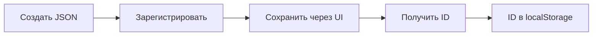
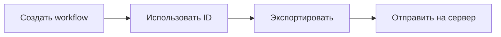

# 📦 Subflow Registry - Управление переиспользуемыми блоками

## Концепция

**Проблема:** Раньше для каждого использования subflow нужно было дублировать его определение в JSON.

**Решение:** Subflow Registry позволяет:
1. ✅ Сохранить subflow **один раз** → получить ID
2. ✅ Использовать ID в любом количестве workflow
3. ✅ Не дублировать определения
4. ✅ Централизованное управление библиотекой subflow

---

## 🚀 Как это работает?

### Шаг 1: Определите subflow один раз

Создайте JSON файл с определением subflow:

```javascript
// src/pages/Sandbox/data/subflows/onboardingFlow.json
{
  "name": "onboarding-flow",
  "description": "Двухэкранный онбординг",
  "input_variables": ["user_id", "store_name"],
  "output_variables": ["completed", "user_preferences"],
  "nodes": [...],
  "screens": {...}
}
```

### Шаг 2: Зарегистрируйте в системе

```javascript
// src/utils/subflowLoader.js
import onboardingFlowData from '../pages/Sandbox/data/subflows/onboardingFlow.json';

export const SUBFLOW_DEFINITIONS = {
  'onboarding-flow': {
    name: 'onboarding-flow',
    description: 'Двухэкранный онбординг',
    input_variables: ['user_id', 'store_name'],
    output_variables: ['completed', 'user_preferences'],
    definition: onboardingFlowData
  }
};
```

### Шаг 3: Сохраните через UI

Откройте **Subflow Manager** в приложении:

```jsx
<SubflowManager baseUrl="http://localhost:3000" />
```

Нажмите **💾 Save** → получите `wf_description_id`

### Шаг 4: Используйте ID везде

Теперь в любом workflow используйте полученный ID:

```json
{
  "state_type": "subflow",
  "name": "UserOnboarding",
  "screen": {},
  "expressions": [{
    "variable": "result",
    "subflow_workflow_id": "67890abcdef123456789",  // ← ID из registry
    "input_mapping": {
      "user_id": "context.user.id",
      "store_name": "context.store.name"
    },
    "output_mapping": {
      "context.onboarding.status": "completed"
    }
  }],
  "transitions": [...],
  "events": []
}
```

---

## 💻 API Reference

### SubflowRegistry Class

```javascript
import { getSubflowRegistry } from './services/subflowRegistry';

const registry = getSubflowRegistry('http://localhost:3000');
```

#### Методы:

##### `register(name, definition, metadata)`
Зарегистрировать новый subflow в памяти

```javascript
registry.register('my-subflow', graphData, {
  description: 'Мой subflow',
  input_variables: ['param1'],
  output_variables: ['result']
});
```

##### `save(name)` → Promise<string>
Сохранить subflow на сервер и получить ID

```javascript
const id = await registry.save('onboarding-flow');
console.log('Saved with ID:', id);
```

##### `getId(name)` → Promise<string>
Получить ID (сохранить если ещё не сохранён)

```javascript
const id = await registry.getId('onboarding-flow');
// Если ID уже есть - вернёт кешированный
// Если нет - сохранит и вернёт новый
```

##### `getMetadata(name)` → Object
Получить метаданные subflow

```javascript
const meta = registry.getMetadata('onboarding-flow');
// { name, description, input_variables, output_variables, id }
```

##### `list()` → Array
Получить список всех subflow

```javascript
const all = registry.list();
// [{ name: 'onboarding-flow', id: '...', ... }, ...]
```

##### `isSaved(name)` → Boolean
Проверить, сохранён ли subflow

```javascript
if (!registry.isSaved('onboarding-flow')) {
  await registry.save('onboarding-flow');
}
```

##### `reset(name)`
Сбросить ID (для пересохранения)

```javascript
registry.reset('onboarding-flow');
await registry.save('onboarding-flow'); // Получит новый ID
```

##### `saveAll()` → Promise<Object>
Сохранить все несохранённые subflow

```javascript
const results = await registry.saveAll();
// { 'onboarding-flow': 'id1', 'insurance-offer': 'id2', ... }
```

---

## 🎣 React Hook

### useSubflowRegistry(baseUrl)

```javascript
import { useSubflowRegistry } from './hooks/useSubflowRegistry';

function MyComponent() {
  const { subflows, save, getId, loading, error } = useSubflowRegistry(baseUrl);

  const handleSave = async () => {
    const id = await save('onboarding-flow');
    console.log('ID:', id);
  };

  return (
    <div>
      {subflows.map(s => (
        <div key={s.name}>
          {s.name}: {s.id || 'Not saved'}
          {!s.id && <button onClick={() => save(s.name)}>Save</button>}
        </div>
      ))}
    </div>
  );
}
```

#### Возвращаемые значения:

- `registry` - Instance SubflowRegistry
- `subflows` - Список subflow с метаданными
- `loading` - Флаг загрузки
- `error` - Сообщение об ошибке (если есть)
- `save(name)` - Сохранить subflow
- `getId(name)` - Получить ID
- `reset(name)` - Сбросить ID
- `register(name, def, meta)` - Зарегистрировать
- `saveAll()` - Сохранить все
- `refresh()` - Обновить список

---

## 🎨 UI Components

### SubflowManager

Полноценный UI для управления subflow:

```jsx
import { SubflowManager } from './components/SubflowManager/SubflowManager';

<SubflowManager baseUrl="http://localhost:3000" />
```

**Возможности:**
- ✅ Просмотр всех зарегистрированных subflow
- ✅ Сохранение на сервер одной кнопкой
- ✅ Копирование ID в clipboard
- ✅ Индикация статуса (saved/not saved)
- ✅ Отображение input/output переменных
- ✅ Инструкции по использованию

---

## 📝 Структура файлов

```
src/
├── services/
│   └── subflowRegistry.js         # Основной класс
├── hooks/
│   └── useSubflowRegistry.js      # React hook
├── components/
│   └── SubflowManager/
│       ├── SubflowManager.jsx     # UI компонент
│       └── SubflowManager.css     # Стили
├── utils/
│   └── subflowLoader.js           # Загрузчик определений
└── pages/Sandbox/data/subflows/
    ├── onboardingFlow.json        # Определение onboarding
    └── ...                        # Другие subflow
```

---

## 💾 Хранение

### localStorage
ID сохраняются в `localStorage` для переиспользования между сессиями:

```javascript
{
  "onboarding-flow": {
    "id": "67890abcdef123456789",
    "name": "onboarding-flow",
    "description": "..."
  }
}
```

### Сервер
Определения subflow сохраняются как обычные workflow через `POST /workflow/save`

---

## 🔄 Workflow использования

### Один раз (Setup):


### Каждый раз (Usage):


---

## 📊 Пример полного цикла

### 1. Создайте subflow файл
```json
// onboardingFlow.json
{
  "name": "onboarding-flow",
  "nodes": [...],
  "screens": {...}
}
```

### 2. Зарегистрируйте
```javascript
// subflowLoader.js
import onboarding from './subflows/onboardingFlow.json';

export const SUBFLOW_DEFINITIONS = {
  'onboarding-flow': {
    definition: onboarding,
    description: '...',
    input_variables: [...],
    output_variables: [...]
  }
};
```

### 3. Сохраните через UI
```
Subflow Manager → 💾 Save → Копировать ID: 67890abcdef...
```

### 4. Используйте в workflow
```json
{
  "state_type": "subflow",
  "expressions": [{
    "subflow_workflow_id": "67890abcdef123456789"
  }]
}
```

---

## ✅ Преимущества

### Без Registry (старый подход):
```json
// workflow1.json
{
  "subflows": {
    "onboarding-flow": { /* 500 строк */ }
  }
}

// workflow2.json
{
  "subflows": {
    "onboarding-flow": { /* те же 500 строк */ }
  }
}

// workflow3.json
{
  "subflows": {
    "onboarding-flow": { /* опять 500 строк */ }
  }
}
```

### С Registry (новый подход):
```json
// onboardingFlow.json (один раз)
{ /* 500 строк */ }

// workflow1.json
{ "subflow_workflow_id": "67890abc..." }

// workflow2.json
{ "subflow_workflow_id": "67890abc..." }

// workflow3.json
{ "subflow_workflow_id": "67890abc..." }
```

**Экономия:** ~1500 строк → ~50 строк!

---

## 🎯 Best Practices

### ✅ DO:
1. Сохраняйте subflow в отдельных JSON файлах
2. Используйте понятные имена (kebab-case)
3. Документируйте input/output переменные
4. Сохраняйте через UI (не вручную)
5. Копируйте ID через кнопку 📋

### ❌ DON'T:
1. Не храните определения внутри workflow
2. Не дублируйте определения
3. Не редактируйте ID вручную
4. Не забывайте про error_variable
5. Не сохраняйте один subflow несколько раз

---

## 🚀 Готовность

**Статус:** ✅ Production Ready

- ✅ Registry реализован
- ✅ UI компонент готов
- ✅ React hook создан
- ✅ localStorage интеграция
- ✅ Документация завершена

---

## 📞 Использование в проекте

### Быстрый старт:

1. Импортируйте SubflowManager в нужной странице
2. Нажмите "Save" для каждого subflow
3. Скопируйте ID
4. Используйте ID в `subflow_workflow_id`

### Готово! 🎉

**Дата:** 18 октября 2025 г.  
**Версия:** 1.0.0
