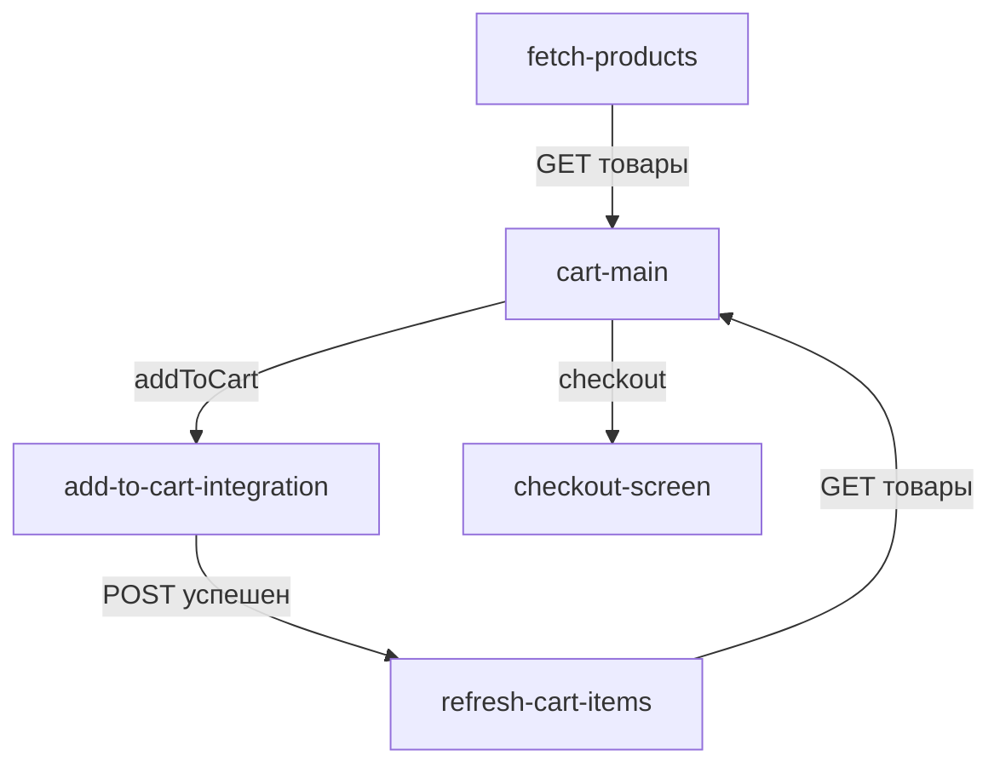

# Добавление функционала "Добавить в корзину"

## Дата: 17 октября 2025

## Описание

Добавлен полный флоу добавления товара в корзину с интеграцией API.

## Реализованный сценарий

```
[Корзина] 
   ↓ (клик "Добавить в корзину")
[add-to-cart-integration] (POST запрос)
   ↓ (успех)
[refresh-cart-items] (GET запрос)
   ↓
[Корзина] (обновленный список)
```

## Изменения в коде

### 1. Обновлен `initialContext` в `avitoDemo.json`

Добавлены новые поля:
```json
{
  "cart": {
    "id": 3,  // ID корзины для API
    ...
  },
  "selected_advertisement_id": null,  // ID выбранного товара
  "add_to_cart_response": null  // Ответ от API добавления
}
```

### 2. Добавлены новые узлы (nodes)

#### `add-to-cart-integration`
- **Тип**: integration
- **Метод**: POST
- **URL**: `https://sandkittens.me/backservices/api/carts/add-advertisement`
- **Body**:
  ```json
  {
    "cart_id": "${cart.id}",
    "advertisement_id": "${selected_advertisement_id}"
  }
  ```

#### `refresh-cart-items`
- **Тип**: integration
- **Метод**: GET
- **URL**: `https://sandkittens.me/backservices/api/advertisements/owner/14`
- **Цель**: Получить обновленный список товаров после добавления

### 3. Обновлен экран корзины

Каждая карточка товара теперь содержит кнопку "Добавить в корзину":

```json
{
  "id": "button-add-to-cart-{{itemIndex}}",
  "type": "button",
  "properties": {
    "text": "Добавить в корзину",
    "variant": "primary",
    "event": "addToCart",
    "eventParams": {
      "advertisement_id": "${product.id}"
    }
  }
}
```

### 4. Обновлен `handleNodeEvent` в `SandboxPage.jsx`

Теперь принимает параметры события и сохраняет их в контекст:

```javascript
const handleNodeEvent = useCallback((eventName, eventParams = {}) => {
  // Сохраняем eventParams в контекст
  if (eventParams && Object.keys(eventParams).length > 0) {
    setContextState((prevContext) => {
      const updatedContext = { ...prevContext };
      Object.entries(eventParams).forEach(([key, value]) => {
        updatedContext[key] = value;
      });
      return updatedContext;
    });
  }
  // ... остальная логика
}, [currentNode, handleEdgeRun]);
```

## API Endpoints

### 1. Добавление товара в корзину
```http
POST https://sandkittens.me/backservices/api/carts/add-advertisement
Content-Type: application/json

{
  "cart_id": 3,
  "advertisement_id": 8
}
```

### 2. Получение товаров
```http
GET https://sandkittens.me/backservices/api/advertisements/owner/14
```

## Граф переходов



## Пользовательский флоу

1. **Загрузка**: При старте выполняется `fetch-products` - загружаются все доступные товары
2. **Отображение**: Пользователь видит список товаров с кнопками "Добавить в корзину"
3. **Добавление**: При клике на кнопку:
   - ID товара сохраняется в `selected_advertisement_id`
   - Выполняется POST-запрос на добавление товара
   - После успеха загружается обновленный список товаров
   - Экран корзины обновляется автоматически

## Особенности реализации

### EventParams
Параметры события передаются через `eventParams` и автоматически биндятся:
```json
"eventParams": {
  "advertisement_id": "${product.id}"
}
```

При клике значение `product.id` извлекается из контекста итерации списка и сохраняется как `advertisement_id`.

### Контекст итерации
В компоненте `list` каждый элемент имеет доступ к:
- `${product}` - текущий товар
- `${product.id}` - ID товара
- `${product.name}` - название товара
- и т.д.

## Тестирование

1. Откройте http://localhost:5174/sandbox
2. Должен загрузиться список товаров
3. У каждого товара есть кнопка "Добавить в корзину"
4. При клике:
   - Выполняется POST-запрос
   - Обновляется список товаров
   - Вы возвращаетесь на экран корзины

## Возможные улучшения

- [ ] Добавить уведомления об успешном добавлении
- [ ] Добавить обработку ошибок API
- [ ] Добавить индикатор загрузки
- [ ] Показывать количество товаров в корзине
- [ ] Добавить возможность удаления товара из корзины
