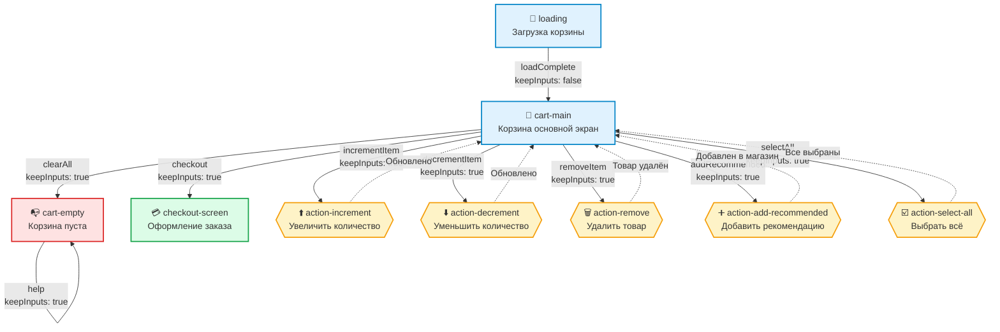
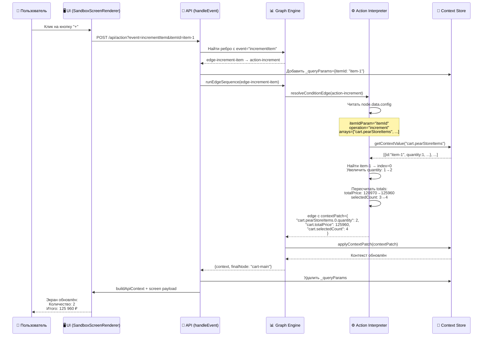

# Граф навигации avitoDemo

## 📊 Визуализация потока корзины Avito



## 🎯 Декларативная архитектура

### События и маппинг

| Событие | Исходный узел | Целевой узел | keepInputs | Описание |
|---------|---------------|--------------|------------|----------|
| `loadComplete` | loading | cart-main | ❌ false | Завершение загрузки корзины |
| `incrementItem` | cart-main | action-increment | ✅ true | Увеличение количества товара |
| `decrementItem` | cart-main | action-decrement | ✅ true | Уменьшение количества товара |
| `removeItem` | cart-main | action-remove | ✅ true | Удаление товара из корзины |
| `addRecommended` | cart-main | action-add-recommended | ✅ true | Добавление рекомендованного товара |
| `checkout` | cart-main | checkout-screen | ✅ true | Переход к оформлению заказа |
| `selectAll` | cart-main | action-select-all | ✅ true | Выбор всех товаров |
| `clearAll` | cart-main | cart-empty | ✅ true | Очистка корзины |
| `help` | cart-empty | cart-empty | ✅ true | Справка (цикличный переход) |

### Action-узлы с конфигурацией

#### 1️⃣ action-increment
```json
{
  "actionType": "modify-cart-item",
  "operation": "increment",
  "config": {
    "itemIdParam": "itemId",
    "minQuantity": 1,
    "maxQuantity": 99,
    "arrays": ["cart.pearStoreItems", "cart.technoStoreItems"],
    "recalculate": ["cart.totalPrice", "cart.selectedCount"]
  }
}
```
**Логика:** Увеличивает `quantity` на 1 (макс 99), пересчитывает итоги

#### 2️⃣ action-decrement
```json
{
  "actionType": "modify-cart-item",
  "operation": "decrement",
  "config": {
    "itemIdParam": "itemId",
    "minQuantity": 1,
    "maxQuantity": 99,
    "arrays": ["cart.pearStoreItems", "cart.technoStoreItems"],
    "recalculate": ["cart.totalPrice", "cart.selectedCount"]
  }
}
```
**Логика:** Уменьшает `quantity` на 1 (мин 1), пересчитывает итоги

#### 3️⃣ action-remove
```json
{
  "actionType": "context-update",
  "description": "Удаляет товар из корзины"
}
```
**Логика:** Применяет `contextPatch` с обновлёнными счётчиками и уведомлением

#### 4️⃣ action-add-recommended
```json
{
  "actionType": "context-update",
  "description": "Добавляет товар из upsell-блока в случайный магазин"
}
```
**Логика:** Случайный выбор между двумя рёбрами (Pear Store / TECHNO ZONE)

#### 5️⃣ action-select-all
```json
{
  "actionType": "context-update",
  "description": "Помечает все товары как выбранные"
}
```
**Логика:** Обновляет `cart.selectedCount`

## 📋 Детальная диаграмма с contextPatch



## 🔄 Пример потока данных

### Исходное состояние
```json
{
  "cart": {
    "pearStoreItems": [
      {"id": "item-1", "quantity": 1, "price": 4990}
    ],
    "totalPrice": 120970,
    "selectedCount": 3
  }
}
```

### Событие: incrementItem (itemId=item-1)

**1. Поиск ребра:**
```javascript
// Сервер ищет в EDGE_REGISTRY
edge = найти ребро где edge.event === "incrementItem"
// Результат: edge-increment-item → action-increment
```

**2. Интерпретация action-узла:**
```javascript
// action-increment.data
{
  "actionType": "modify-cart-item",
  "operation": "increment",
  "config": {
    "itemIdParam": "itemId",
    "arrays": ["cart.pearStoreItems", "cart.technoStoreItems"],
    "recalculate": ["cart.totalPrice", "cart.selectedCount"]
  }
}

// Сервер выполняет:
itemId = context._queryParams.itemId // "item-1"
items = context.cart.pearStoreItems  // массив товаров
item = items.find(i => i.id === itemId) // item-1
item.quantity++ // 1 → 2

// Пересчёт:
totalPrice = sum(all items: price * quantity) // 125960
selectedCount = sum(all items: quantity) // 4
```

**3. Генерация contextPatch:**
```json
{
  "cart.pearStoreItems.0.quantity": 2,
  "cart.totalPrice": 125960,
  "cart.selectedCount": 4
}
```

**4. Применение патча:**
```javascript
applyContextPatch(context, patch)
```

**5. Финальное состояние:**
```json
{
  "cart": {
    "pearStoreItems": [
      {"id": "item-1", "quantity": 2, "price": 4990}
    ],
    "totalPrice": 125960,
    "selectedCount": 4
  }
}
```

## 🎨 Легенда узлов

| Тип узла | Обозначение | Описание |
|----------|-------------|----------|
| 🔄 Screen (start) | Прямоугольник голубой | Экран загрузки (стартовый) |
| 🛒 Screen | Прямоугольник голубой | Обычный экран |
| ⚙️ Action | Ромб жёлтый | Action-узел с бизнес-логикой |
| 📭 Screen (empty) | Прямоугольник красный | Экран пустого состояния |
| 💳 Screen (final) | Прямоугольник зелёный | Финальный экран (оформление) |

## 🔗 Типы рёбер

| Стиль | Описание |
|-------|----------|
| `───>` сплошная линия | Прямой переход (пользовательское событие) |
| `-.->` пунктир | Возврат из action-узла (автоматический) |

## 📊 Статистика графа

| Метрика | Значение |
|---------|----------|
| Всего узлов | 9 |
| Screen-узлы | 4 |
| Action-узлы | 5 |
| Всего рёбер | 14 |
| Событий (events) | 9 |
| Циклических переходов | 1 (help → cart-empty) |

## 🚀 Преимущества декларативного подхода

1. **Визуальная ясность**: Граф показывает все возможные пути пользователя
2. **Самодокументирование**: События описаны в рёбрах с `keepInputs`
3. **Универсальность**: Сервер интерпретирует любую конфигурацию
4. **Расширяемость**: Добавление события = добавление ребра в JSON
5. **Тестируемость**: Легко проверить все пути через API

## 📝 Примечания

- **Стартовый узел**: `loading` (единственный с `start: true`)
- **Финальные узлы**: `checkout-screen` (нет исходящих рёбер)
- **Циклические узлы**: `cart-empty` (событие `help` возвращает на себя)
- **Action-узлы**: Всегда возвращаются на экран через пунктирные рёбра
- **keepInputs**: Сохраняет параметры события (например, `itemId`) для action-узлов

---

**Создано:** 30 сентября 2025 г.  
**Граф для:** avitoDemo.json  
**Формат:** Декларативная архитектура с events в edges
