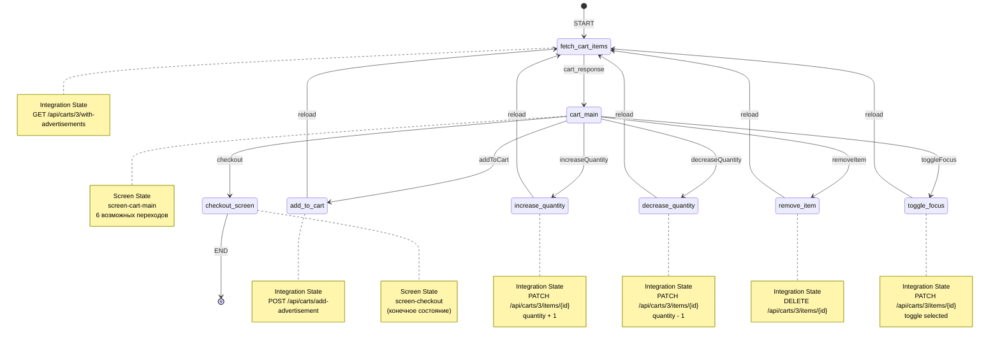

# Граф переходов: Авито Корзина (avitoDemo)

## Обзор воркфлоу

**ID**: `avito-cart-demo`  
**Название**: Авито — Корзина  
**Описание**: Профессиональный сценарий корзины с загрузкой товаров из API

---

## Диаграмма состояний



---

## Детальное описание состояний

### 1. **fetch-cart-items** (Загрузка корзины)
- **Тип**: Integration State
- **Старт**: ✅ Да (начальное состояние)
- **API**: `GET https://sandkittens.me/backservices/api/carts/3/with-advertisements`
- **Переменная**: `cart_response`
- **Переход**: → `cart-main` (после успешной загрузки)

---

### 2. **cart-main** (Главный экран корзины)
- **Тип**: Screen State
- **Screen ID**: `screen-cart-main`
- **Возможные события**:
  1. `addToCart` → add-to-cart-integration
  2. `increaseQuantity` → increase-quantity-integration
  3. `decreaseQuantity` → decrease-quantity-integration
  4. `removeItem` → remove-item-integration
  5. `toggleFocus` → toggle-focus-integration
  6. `checkout` → checkout-screen

---

### 3. **add-to-cart-integration** (Добавление товара)
- **Тип**: Integration State
- **API**: `POST https://sandkittens.me/backservices/api/carts/add-advertisement`
- **Body**: 
  ```json
  {
    "cart_id": 3,
    "advertisement_id": 9
  }
  ```
- **Переход**: → `fetch-cart-items` (перезагрузка корзины)

---

### 4. **increase-quantity-integration** (Увеличение количества)
- **Тип**: Integration State
- **API**: `PATCH https://sandkittens.me/backservices/api/carts/3/items/${selected_item_id}`
- **Body**: 
  ```json
  {
    "quantity": "${quantity_change + 1}"
  }
  ```
- **Переход**: → `fetch-cart-items` (перезагрузка корзины)

---

### 5. **decrease-quantity-integration** (Уменьшение количества)
- **Тип**: Integration State
- **API**: `PATCH https://sandkittens.me/backservices/api/carts/3/items/${selected_item_id}`
- **Body**: 
  ```json
  {
    "quantity": "${quantity_change - 1}"
  }
  ```
- **Переход**: → `fetch-cart-items` (перезагрузка корзины)

---

### 6. **remove-item-integration** (Удаление товара)
- **Тип**: Integration State
- **API**: `DELETE https://sandkittens.me/backservices/api/carts/3/items/${selected_item_id}`
- **Переход**: → `fetch-cart-items` (перезагрузка корзины)

---

### 7. **toggle-focus-integration** (Переключение выбора)
- **Тип**: Integration State
- **API**: `PATCH https://sandkittens.me/backservices/api/carts/3/items/${selected_item_id}`
- **Body**: 
  ```json
  {
    "selected": "${!product.selected}"
  }
  ```
- **Переход**: → `fetch-cart-items` (перезагрузка корзины)

---

### 8. **checkout-screen** (Оформление заказа)
- **Тип**: Screen State
- **Screen ID**: `screen-checkout`
- **Переходы**: Нет (конечное состояние)

---

## Паттерны взаимодействия

### 1. **Цикл обновления данных**
```
cart-main → [action-integration] → fetch-cart-items → cart-main
```

Все операции (add, increase, decrease, remove, toggle) следуют этому циклу:
- Пользователь выполняет действие на экране
- Вызывается соответствующий API endpoint
- Корзина перезагружается с сервера
- Возврат на главный экран с обновленными данными

### 2. **Линейный выход**
```
cart-main → checkout-screen → [END]
```

Оформление заказа — это терминальное состояние без возврата.

---

## Переменные контекста

| Переменная | Тип | Описание |
|------------|-----|----------|
| `cart_response` | object | Полный объект корзины с товарами |
| `store` | object | Информация о магазине |
| `selected_advertisement_id` | number | ID выбранного объявления |
| `selected_item_id` | number | ID выбранного товара в корзине |
| `quantity_change` | number | Текущее количество для изменения |
| `suggested_products` | array | Рекомендуемые товары |
| `ui` | object | Состояние UI (ready, notifications) |
| `state` | object | Состояние приложения (empty, loading) |

---

## Архитектурные особенности

### ✅ Преимущества
1. **Единая точка загрузки**: Все операции приводят к перезагрузке через `fetch-cart-items`
2. **Консистентность данных**: Backend всегда источник истины
3. **Простота отладки**: Линейный flow для каждой операции
4. **API-driven**: Все изменения через REST API

### ⚠️ Потенциальные оптимизации
1. **Оптимистичные обновления**: Можно обновлять UI до получения ответа от сервера
2. **Частичная загрузка**: Не всегда нужна полная перезагрузка корзины
3. **Кэширование**: Можно кэшировать `cart_response` между операциями
4. **Batch операции**: Группировать несколько изменений в один запрос

---

## Примеры сценариев

### Сценарий 1: Добавление товара в корзину
```
START → fetch_cart_items → cart_main 
      → (user clicks "В корзину") 
      → add_to_cart 
      → fetch_cart_items 
      → cart_main
```

### Сценарий 2: Изменение количества
```
cart_main → (user clicks "+") 
          → increase_quantity 
          → fetch_cart_items 
          → cart_main
```

### Сценарий 3: Оформление заказа
```
cart_main → (user clicks "Оформить") 
          → checkout_screen 
          → END
```

---

## Граф в текстовом формате

```
[START]
  ↓
fetch-cart-items (Integration)
  ↓ cart_response
cart-main (Screen) ←─────────────────┐
  ├→ addToCart          → add-to-cart-integration          ─┐
  ├→ increaseQuantity   → increase-quantity-integration    ─┤
  ├→ decreaseQuantity   → decrease-quantity-integration    ─┤
  ├→ removeItem         → remove-item-integration          ─┤
  ├→ toggleFocus        → toggle-focus-integration         ─┤
  └→ checkout           → checkout-screen → [END]           │
                                                            │
  ┌─────────────────────────────────────────────────────────┘
  ↓
fetch-cart-items (reload)
  ↓
(цикл повторяется)
```

---

## Статистика

- **Всего состояний**: 8
- **Screen состояний**: 2 (cart-main, checkout-screen)
- **Integration состояний**: 6
- **Стартовое состояние**: fetch-cart-items
- **Конечное состояние**: checkout-screen
- **Циклических путей**: 1 (через fetch-cart-items)
- **API endpoints**: 6 (1 GET, 1 POST, 3 PATCH, 1 DELETE)

