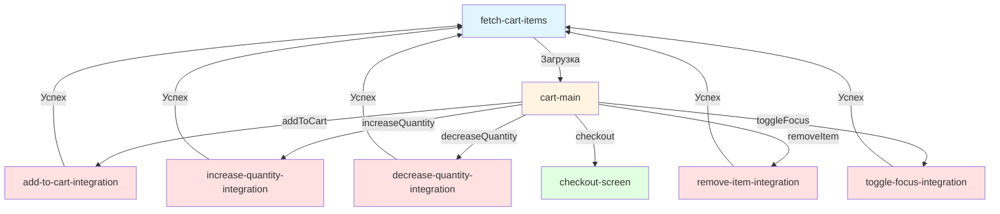

# Реализация экрана корзины

## 📋 Обзор

Создан полнофункциональный экран корзины с двумя состояниями (пустая/заполненная) и полным набором интеграционных состояний для управления товарами.

## 🎯 Реализованные функции

### 1. **Два состояния экрана**

#### Пустое состояние (`cart_response.advertisements.length === 0`)
- 🛒 Иконка пустой корзины (placeholder изображение)
- 📝 Заголовок: "В корзине пусто"
- 💬 Подсказка: "Добавьте товары из каталога"
- 🎨 Центрированный layout с вертикальным выравниванием

#### Заполненное состояние (`cart_response.advertisements.length > 0`)
- 📦 Список товаров с карточками
- 🛍️ Блок предлагаемых товаров
- 💰 Футер с итоговой стоимостью и кнопкой оформления

---

## 🔧 Интеграционные состояния

### 1. **Увеличение количества** (`increase-quantity-integration`)
```json
{
  "method": "PATCH",
  "url": "/api/carts/update-quantity",
  "body": {
    "cart_id": 3,
    "advertisement_id": "${selected_item_id}",
    "quantity_change": 1
  }
}
```
- **Событие**: `increaseQuantity`
- **Параметры**: `selected_item_id` (ID товара)
- **Переход**: → `fetch-cart-items` (обновление корзины)

---

### 2. **Уменьшение количества** (`decrease-quantity-integration`)
```json
{
  "method": "PATCH",
  "url": "/api/carts/update-quantity",
  "body": {
    "cart_id": 3,
    "advertisement_id": "${selected_item_id}",
    "quantity_change": -1
  }
}
```
- **Событие**: `decreaseQuantity`
- **Параметры**: `selected_item_id` (ID товара)
- **Переход**: → `fetch-cart-items`

---

### 3. **Удаление товара** (`remove-item-integration`)
```json
{
  "method": "DELETE",
  "url": "/api/carts/remove-advertisement",
  "body": {
    "cart_id": 3,
    "advertisement_id": "${selected_item_id}"
  }
}
```
- **Событие**: `removeItem`
- **Параметры**: `selected_item_id` (ID товара)
- **Переход**: → `fetch-cart-items`
- **Визуал**: Кнопка 🗑️ в правом верхнем углу карточки

---

### 4. **Снятие/возврат фокуса** (`toggle-focus-integration`)
```json
{
  "method": "PATCH",
  "url": "/api/carts/toggle-focus",
  "body": {
    "cart_id": 3,
    "advertisement_id": "${selected_item_id}"
  }
}
```
- **Событие**: `toggleFocus`
- **Параметры**: `selected_item_id` (ID товара)
- **Переход**: → `fetch-cart-items`
- **Визуал**: Чекбокс ☑️/⬜ в правом верхнем углу карточки
- **Эффект**: Товар без фокуса имеет `opacity: 0.5` и не участвует в расчете

---

### 5. **Добавление предлагаемого товара** (`add-to-cart-integration`)
```json
{
  "method": "POST",
  "url": "/api/carts/add-advertisement",
  "body": {
    "cart_id": 3,
    "advertisement_id": 10
  }
}
```
- **Событие**: `addToCart`
- **Параметры**: `advertisement_id` (ID предлагаемого товара)
- **Переход**: → `fetch-cart-items`
- **Визуал**: Кнопка "В корзину" в карточке предлагаемого товара

---

## 📊 Структура данных

### Обновленная схема `cart_response`
```json
{
  "cart_response": {
    "id": 3,
    "user_id": 14,
    "advertisements": [
      {
        "id": 1,
        "name": "Товар",
        "description": "Описание",
        "price": 1000,
        "quantity": 2,
        "is_focused": true,
        "image": "https://..."
      }
    ],
    "total_price": 2000,
    "selected_count": 1
  }
}
```

### Новые переменные
- `selected_item_id`: ID выбранного товара для операций
- `quantity_change`: Изменение количества (+1 или -1)
- `suggested_products`: Массив предлагаемых товаров

---

## 🎨 UI компоненты

### Карточка товара в корзине
```
┌────────────────────────────────────────┐
│ [Фото]  Название товара          🗑️ ☑️│
│         Описание                       │
│         1 000 ₽                        │
│                           [−] 2 [+]   │
└────────────────────────────────────────┘
```

**Элементы**:
- 🖼️ Изображение 80×80px
- 📝 Название (fontSize: 15px, fontWeight: 600)
- 💬 Описание (fontSize: 13px, color: #8E8E93)
- 💰 Цена (fontSize: 17px, fontWeight: 700)
- 🔢 Счетчик с кнопками ±
- 🗑️ Кнопка удаления
- ☑️ Чекбокс фокуса

**Динамика**:
- `opacity: 0.5` для товаров без фокуса (`is_focused: false`)
- Все действия передают `selected_item_id` в eventParams

---

### Карточка предлагаемого товара
```
┌──────────────────────────────────────┐
│ [Фото] Название       [В корзину]   │
│        1 000 ₽                       │
└──────────────────────────────────────┘
```

**Элементы**:
- 🖼️ Изображение 60×60px
- 📝 Название (fontSize: 14px)
- 💰 Цена (fontSize: 15px, fontWeight: 700)
- ➕ Кнопка "В корзину" (primary, blue)

**Источник данных**: `${suggested_products}`

---

### Футер с итоговой информацией
```
┌──────────────────────────────────────┐
│ Итого                  Выбрано: 2    │
│ 2 000 ₽                              │
│                                       │
│     [Оформить доставку]              │
└──────────────────────────────────────┘
```

**Элементы**:
- 💰 Итоговая цена (`cart_response.total_price`)
- 🔢 Количество выбранных (`cart_response.selected_count`)
- 🚚 Кнопка оформления (disabled если корзина пуста)

---

## 🔄 Граф переходов



**Логика**:
1. Все изменения корзины (добавление, удаление, изменение количества) → **fetch-cart-items**
2. После каждой операции корзина обновляется с сервера
3. `cart-main` отображает актуальное состояние

---

## 🎯 Примеры использования

### 1. Добавление товара
```javascript
// Пользователь нажимает "В корзину" на предлагаемом товаре
event: "addToCart"
eventParams: {
  advertisement_id: 10  // ID из ${suggested.id}
}
```

### 2. Увеличение количества
```javascript
// Пользователь нажимает [+] на карточке товара
event: "increaseQuantity"
eventParams: {
  selected_item_id: 5  // ID из ${product.id}
}
```

### 3. Снятие фокуса
```javascript
// Пользователь нажимает чекбокс ☑️
event: "toggleFocus"
eventParams: {
  selected_item_id: 5
}
// Товар становится полупрозрачным и не участвует в расчете
```

### 4. Удаление товара
```javascript
// Пользователь нажимает 🗑️
event: "removeItem"
eventParams: {
  selected_item_id: 5
}
// Товар удаляется из корзины
```

---

## 🔍 Условная логика

### Отображение пустого состояния
```json
{
  "type": "conditional",
  "properties": {
    "condition": {
      "reference": "${cart_response.advertisements.length === 0}",
      "value": true
    }
  }
}
```

### Отображение списка товаров
```json
{
  "type": "conditional",
  "properties": {
    "condition": {
      "reference": "${cart_response.advertisements.length > 0}",
      "value": false
    }
  }
}
```

### Отключение кнопки оформления
```json
{
  "type": "button",
  "properties": {
    "disabled": {
      "reference": "${cart_response.advertisements.length === 0}",
      "value": true
    }
  }
}
```

### Визуальное затемнение товара без фокуса
```json
{
  "style": {
    "opacity": {
      "reference": "${product.is_focused ? 1 : 0.5}",
      "value": 1
    }
  }
}
```

---

## 📡 API endpoints

| Метод | URL | Описание |
|-------|-----|----------|
| GET | `/api/carts/3/with-advertisements` | Загрузка корзины |
| POST | `/api/carts/add-advertisement` | Добавление товара |
| PATCH | `/api/carts/update-quantity` | Изменение количества |
| DELETE | `/api/carts/remove-advertisement` | Удаление товара |
| PATCH | `/api/carts/toggle-focus` | Переключение фокуса |

---

## ✨ Преимущества реализации

1. **DRY принцип**: Все операции возвращаются в `fetch-cart-items` для обновления
2. **Понятная навигация**: Четкий граф состояний
3. **Реактивность**: UI обновляется автоматически после каждой операции
4. **UX**: Визуальная обратная связь (opacity, disabled кнопки)
5. **Extensibility**: Легко добавить новые типы операций
6. **BDUI-совместимость**: Все компоненты следуют schema из prompts

---

## 🚀 Следующие шаги

1. **Тестирование**: Проверить все сценарии в браузере
2. **Backend**: Реализовать API endpoints
3. **Анимации**: Добавить transitions для smooth UX
4. **Оптимизация**: Debounce для rapid clicks на [+]/[-]
5. **Аналитика**: Добавить tracking событий
6. **Accessibility**: ARIA labels для screen readers

---

## 📝 Техническая информация

**Файл**: `src/pages/Sandbox/data/avitoDemo.json`  
**Дата создания**: 17 октября 2025  
**Версия**: 2.0.0  
**Статус**: ✅ JSON валиден, ошибок не найдено

