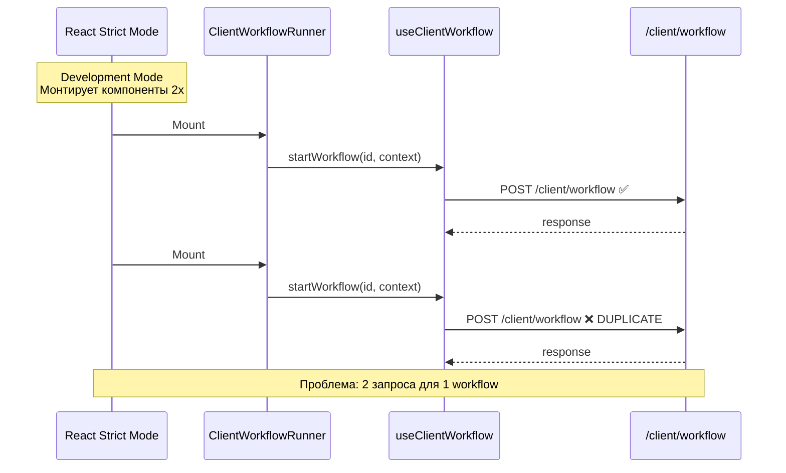
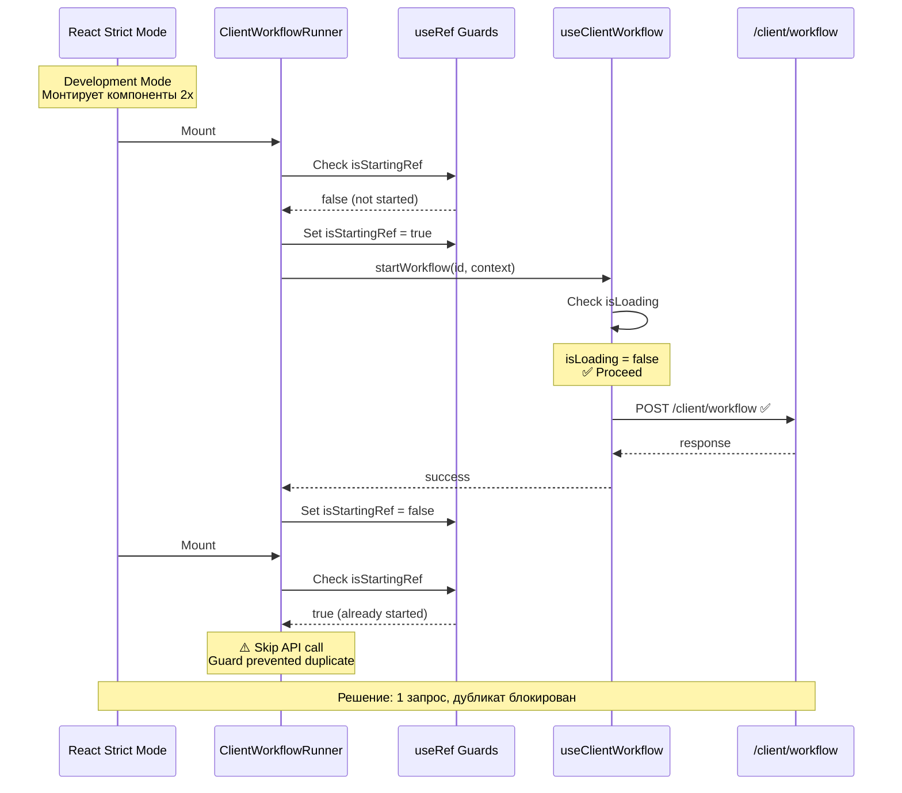
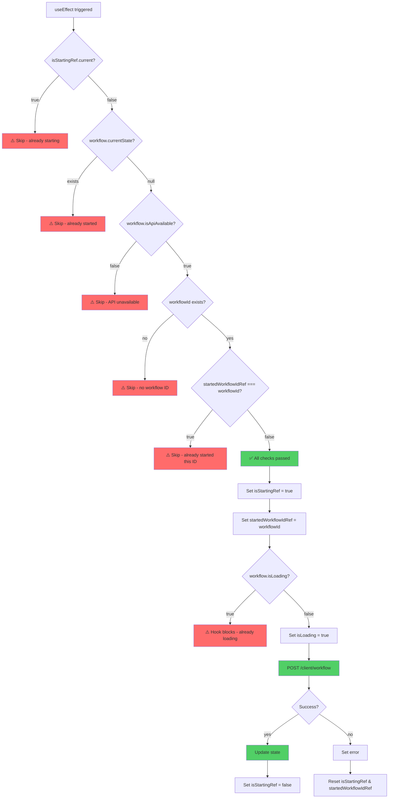

# Визуализация защиты от двойных вызовов

## 🔄 Поток выполнения (до исправления)



## ✅ Поток выполнения (после исправления)



## 🛡️ Механизм защиты (детально)



## 🎯 Три уровня защиты

```
┌─────────────────────────────────────────────────────────────┐
│                    Level 1: Component                        │
│  ┌────────────────────────────────────────────────────────┐ │
│  │  useRef Guards                                          │ │
│  │  • isStartingRef: флаг процесса запуска                │ │
│  │  • startedWorkflowIdRef: ID запущенного workflow       │ │
│  │                                                         │ │
│  │  ✅ Блокирует повторные вызовы в одном компоненте     │ │
│  └────────────────────────────────────────────────────────┘ │
└─────────────────────────────────────────────────────────────┘
                              ↓
┌─────────────────────────────────────────────────────────────┐
│                    Level 2: Hook                            │
│  ┌────────────────────────────────────────────────────────┐ │
│  │  isLoading State                                        │ │
│  │  • Проверка перед каждым API вызовом                   │ │
│  │  • Игнорирует вызовы, если уже загружается            │ │
│  │                                                         │ │
│  │  ✅ Защита от race conditions                          │ │
│  └────────────────────────────────────────────────────────┘ │
└─────────────────────────────────────────────────────────────┘
                              ↓
┌─────────────────────────────────────────────────────────────┐
│                    Level 3: Dependencies                     │
│  ┌────────────────────────────────────────────────────────┐ │
│  │  useEffect Dependencies                                 │ │
│  │  • [workflowId, isApiAvailable, currentState]          │ │
│  │  • Предотвращает устаревшие замыкания                 │ │
│  │                                                         │ │
│  │  ✅ Правильная реактивность                            │ │
│  └────────────────────────────────────────────────────────┘ │
└─────────────────────────────────────────────────────────────┘
```

## 📊 Сравнение поведения

### Scenario 1: React Strict Mode (Development)

| Момент времени | До исправления | После исправления |
|---------------|---------------|------------------|
| t=0ms | Mount #1 | Mount #1 |
| t=10ms | **POST /client/workflow** | **POST /client/workflow** |
| t=50ms | Mount #2 (Strict Mode) | Mount #2 (Strict Mode) |
| t=60ms | **POST /client/workflow** ❌ | ⚠️ Skip (isStartingRef=true) ✅ |
| t=100ms | 2 requests completed | 1 request completed |

### Scenario 2: Параллельные вызовы

| Вызов | До исправления | После исправления |
|-------|---------------|------------------|
| Call #1 | POST /client/workflow | POST /client/workflow |
| Call #2 (parallel) | POST /client/workflow ❌ | ⚠️ Ignored (isLoading) ✅ |
| Call #3 (after #1) | POST /client/workflow | POST /client/workflow |

### Scenario 3: Переключение workflow_id

| Действие | workflow_id | Поведение |
|---------|-------------|-----------|
| Открыть /preview?id=111 | 111 | POST /client/workflow (id=111) ✅ |
| Изменить на ?id=222 | 222 | POST /client/workflow (id=222) ✅ |
| Вернуться на ?id=111 | 111 | POST /client/workflow (id=111) ✅ |

*Каждый новый workflow_id — новый запрос (это правильно)*

## 🎓 Ключевые концепции

### useRef vs useState

```javascript
// ❌ useState вызывает ре-рендер
const [isStarting, setIsStarting] = useState(false);
// Каждый setIsStarting(true) → ре-рендер → новый useEffect

// ✅ useRef НЕ вызывает ре-рендер
const isStartingRef = useRef(false);
// Изменение isStartingRef.current → без ре-рендера → useEffect стабилен
```

### Почему три проверки?

```javascript
if (
  !isStartingRef.current &&        // Защита от Strict Mode
  !workflow.currentState &&          // Защита от повторного старта
  workflow.isApiAvailable &&         // Защита от вызова до готовности API
  workflowId &&                      // Защита от пустого ID
  startedWorkflowIdRef.current !== workflowId  // Защита от повторного ID
) {
  // Все проверки пройдены — безопасно стартовать
}
```

---

**Документация актуальна на:** 1 октября 2025
